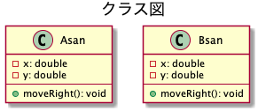

# 本日は

プログラミング言語(の学び方)を学びます。
題材としてPythonを使います。

---

## プログラミング言語としての大体の分類

Pythonは多くのハードウェアとOS (プラットフォーム) に対応しており、複数のプログラミングパラダイムに対応している。
Pythonはオブジェクト指向、命令型、手続き型、関数型などの形式でプログラムを書くことができる。
動的型付け言語であり、参照カウントベースの自動メモリ管理（ガベージコレクタ）を持つ。

[Wikipedia](https://ja.wikipedia.org/wiki/Python) より。

---

### プログラミングパラダイムとは

プログラミング言語をプログラマから見たときの視点のこと。

オブジェクト指向、手続き型、関数型、などが代表的。

オブジェクト指向プログラミングができるか？
処理を順に書くようになっているか？
関数型の評価が行われるか？

などと言う見方。

細かくは厳密な定義がされていたりされていなかったりするため、
なんとなく索引付けして覚える際に使える考え方。

---

## 作者

[Guido van Rossum](https://ja.wikipedia.org/wiki/グイド・ヴァンロッサム)

---

## 特徴

文法を極力単純化してコードの可読性を高め、読みやすく、また書きやすくしてプログラマの作業性とコードの信頼性を高めることを重視してデザインされた、汎用の高水準言語である。

核となる本体部分は必要最小限に抑えられている。
一方で標準ライブラリやサードパーティ製のライブラリ、関数など、さまざまな領域に特化した豊富で大規模なツール群が用意され、インターネット上から無料で入手でき、自らの使用目的に応じて機能を拡張していくことができる。

[Wikipedia](https://ja.wikipedia.org/wiki/Python) より。

---

## 書き方の特徴

[コーディング規約 (Style Guide)](https://pep8-ja.readthedocs.io/ja/latest/)

まずはざっと読んでみましょう。

---

### PEP8の補足

この文書は *Python の標準ライブラリに含まれているPythonコードの* コーディング規約です。

だそうです。そのまま取り入れているプロジェクトも多数あるとか。

*一貫性にこだわりすぎるのは、狭い心の現れである*

コードが書かれた経緯も理解しましょう。

---

# 書いてみよう

python 検索

---

それらしいページを探す。

* [Welcome to Python.org](https://www.python.org/)

---

Get Startedを読む。

最近は大体以下が書いてある。

* Install
* Tutorial

---

## インストール

Macの人はインストール済みのはず。

Windowsの人は、色々とWindows固有の面倒を回避するため、WSLを使う。
Windows10 WSL 有効化 で検索。

---

## WSL Ubuntuのインストール

Windows ストアでubuntuを検索。
Ubuntuをインストールして、起動。

Ubuntuのユーザー名、パスワードは自由に。

```
cat /etc/os-release
# => Ubuntu 18.04 LTS

sudo apt update
```

コピペは
範囲選択 = コピー
右クリック = ペースト
かも。

---

## Pythonのインストール

入っているはず。

```
python3 -V
  # => Python 3.6.9
```

**※個人のPCでやる場合は環境が壊れると困るので、その場合はvirtualenvを入れて使用してください。**

---

## チュートリアルをやってみる

[(ここ)](https://docs.python.org/3/tutorial/interpreter.html)

作業ディレクトリ

```
mkdir -p work/python
cd work/python
```

Pythonをインタラクティブモードで起動する

```
$ python3
>>>
```

以降はPythonのコード

```
the_world_is_flat = True
if the_world_is_flat:
    print("Be careful not to fall off!")
```

---

### モジュール

[モジュールもやってみる](https://docs.python.org/3/tutorial/modules.html)

以下のようにしてモジュールに書かれたコードを読み込める。

```
$ touch fibo.py
$ vim fibo.py
  # < コピペ
$ python3
>>> import fibo
```

---

### 6.1.1. Executing modules as scripts

Pythonで以下のように書く場合は

```
if __name__ == "__main__":
    import sys
    fib(int(sys.argv[1]))
```

スクリプトとして実行された場合に `__name__` と言う変数にセットされる値が `"__main__"` になると言うことは覚えておいた方が良い。

---

### Vim

Unix系OSで標準で使えることが多いエディタ。
ノーマルモードと入力モードがある。
最初はノーマルモードで、コマンドを受け付ける。
`i` コマンドで、入力モードになる。
`ESC` でノーマルモードに戻る、コマンドのキャンセルも。
Undoは `u` コマンド、Redoは `Ctrl+r` コマンド。
保存して終了は `:wq` コマンド、保存しないときは `:!q`コマンド。

---

### 6.1.2. The Module Search Path

当然、その場に置いてあるファイルからしかインポートできない訳ではない。

以降も色々と環境周りについて書いてある。

---

## 例外処理

[8. Errors and Exceptions](https://docs.python.org/3/tutorial/errors.html)

大体、知っていることが書いてあるはず。

---

## スコープ

そろそろ左上から Japanese を選びましょう。

[9.2. Python のスコープと名前空間](https://docs.python.org/ja/3/tutorial/classes.html)

*インタプリタのトップレベルで実行された文は、スクリプトファイルから読み出されたものでも対話的に読み出されたものでも、 __main__ という名前のモジュールの一部分であるとみなされるので、独自の名前空間を持つことになります。*

*スコープは静的に決定されますが、動的に使用されます。実行中はいつでも、直接名前空間にアクセス可能な、少なくとも三つの入れ子になったスコープがあります:*

実際に 9.2.1. スコープと名前空間の例 を実行してみて、概要を掴みましょう。
ざっくり言えば、今使いたい名前を、呼び出し箇所(内側)から検索していって、なければ上位のスコープ、と進んでいき、 `__main__` にたどり着いてもまだなければ、「そんな変数定義されていないよ」と言う仕組みのことですね。

---

## クラス

###

9.3.1. クラス定義の構文

*関数定義 (def 文) と同様、クラス定義が効果をもつにはまず実行しなければなりません。 (クラス定義を if 文の分岐先や関数内部に置くことも、考え方としてはありえます。)*

普段なんとなくライブラリに定義されたクラスを使っているかもしれませんが、それもどこかで読み込まれています。

---

## ここまでで

Pythonの概要は掴めましたか？

---

### 実用的には

すぐにスクリプトが書けるので、ファイルから特定のパターンを探して、カウントするとか、文字を置換するとか、並び替えるとか、などが簡単に行えます。

---

# もっと使ってみよう

Webシステムを考えましょう。

---

## 問題(イントロダクションより再掲)

AさんとBさんは同僚で、同じ道沿いに住んでいます。
毎日その道を通って、駅から会社に一緒に向かいます。
AさんはBさんよりも駅に近く、駅から1km。Bさんは1.5kmの位置に住んでいます。
ある日、いつもBさんが来る時間にAさんが家の前で待っていると、寝坊をしたBさんから連絡がありました。
「寝坊した！今から家を出る！走って追いつくから、先に行ってて！」
BさんがAさんに追いつくには、いつもよりどれだけ早く走らないといけないでしょうか？

---

## AさんとBさんをプログラム化する

AさんとBさんは家から駅まで一本道を進む

-----Bさん-----Aさん----------駅----------

座標とメソッドだけ



[プログラム](https://github.com/kendohub/pie/tree/master/extras/Computing)

---

## Pythonで動かしてみる

```
sudo apt install -y python3-pip
  # 更新されるパッケージがあるのでなんとかを再起動するか聞かれるのでYesを選択する
pip3 -V
  # => pip 9.0.1 from /usr/lib/python3/dist-packages (python 3.6)
```

**[※個人のPCでやる場合は](https://www.python.jp/install/ubuntu/index.html)**

---

### Flaskを導入

```
pip3 install Flask
python3 -m flask --version
  # => Python 3.6.9
  #    Flask 1.1.1
  #    Werkzeug 0.16.0
```

---

### [クイックスタート](https://a2c.bitbucket.io/flask/quickstart.html)

デバッグモードで実行

```
from flask import Flask
app = Flask(__name__)

@app.route('/')
def hello_world():
    return "Hello World!"

if __name__ == '__main__':
    app.run(debug=True)
```

```
python3 hello.py
```

Chromeで http://localhost:5000/ へアクセス。

---

### JSONを返す

jsonifyをインポート

```
from flask import Flask, jsonify

...
def hello_world():
    return jsonify({'message': 'Hello, world'})
```

---

### 演習：クラスを実装(5分)

何もないところに書く。
こんな感じで呼び出せるように。

```
@app.route('/')
def hello_world():
    return jsonify({'a_san': (a_san.x, a_san.y), 'b_san': (b_san.x, b_san.y)})

@app.route('/moved')
def moved():
    a_san.moveRight()
    b_san.moveRight()
    return jsonify({'a_san': (a_san.x, a_san.y), 'b_san': (b_san.x, b_san.y)})
```

/moved に100回アクセスすると、正解がわかる。

---

### 回答

```
from flask import Flask, jsonify

# --- クラス定義
class Asan:
    def __init__(self, x, y):
        self.x = x
        self.y = y

    def moveRight(self):
        self.x += 1.0

class Bsan:
    def __init__(self, x, y):
        self.x = x
        self.y = y

    def moveRight(self):
        self.x += 1.5

a_san = Asan(50, 100)
b_san = Bsan(0, 100)

# ---

app = Flask(__name__)

@app.route('/')
def hello_world():
    return jsonify({'a_san': (a_san.x, a_san.y), 'b_san': (b_san.x, b_san.y)})

@app.route('/moved')
def moved():
    a_san.moveRight()
    b_san.moveRight()
    return jsonify({'a_san': (a_san.x, a_san.y), 'b_san': (b_san.x, b_san.y)})

if __name__ == '__main__':
    app.run(debug=True)
```

---

### 以上

GitHubにアップしたら終了です。

表示用のJavaScriptと組み合わせたり、データベースに座標を保存したりすると、Webシステムになりますね。

---

## インストールコマンド

```
sudo apt install -y python3-pip
pip3 install Flask
```
